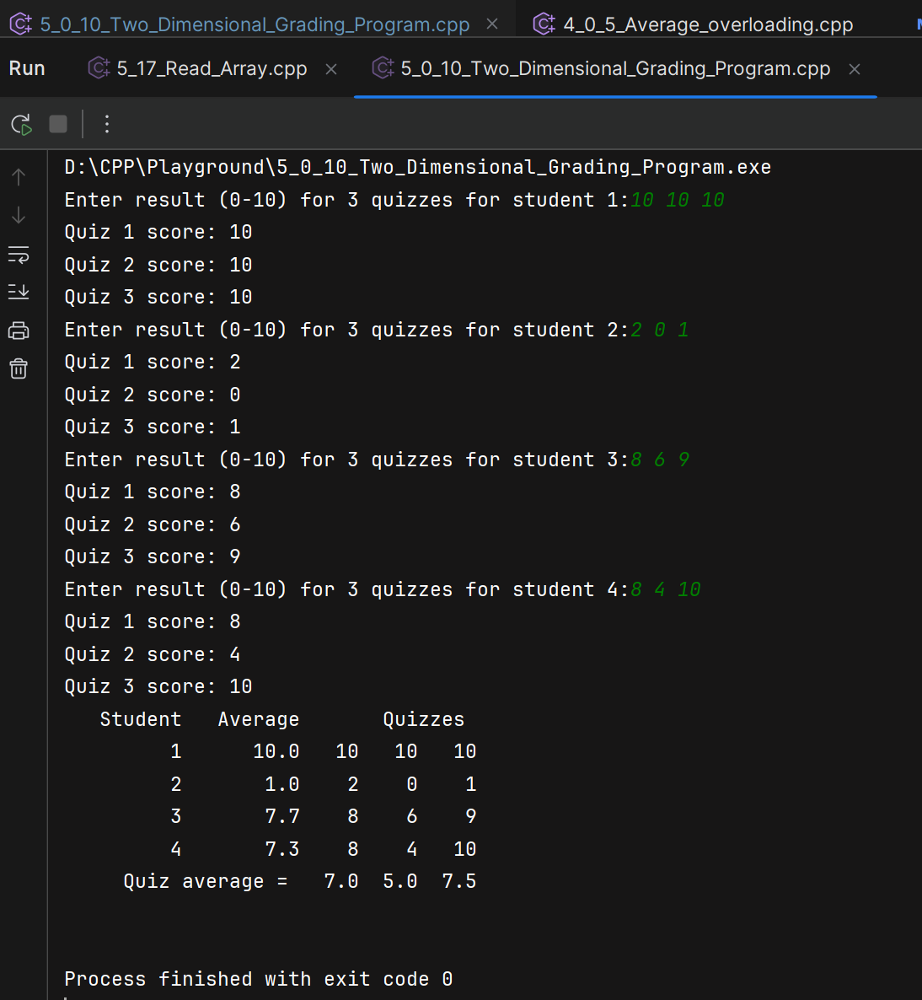

`Program 5.0.10` contains a program that uses a two-dimensional array named grade to
store and then display the grade records for a small class. The class has four students,
and the records include three quizzes. `Table (a)` below illustrates how the array grade is
used to store data. The first array index is used to designate a student, and the second
array index is used to designate a quiz. Since the students and quizzes are numbered
starting with 1 rather than 0, we must subtract 1 from the student number and subtract
1 from the quiz number to obtain the indexed variable that stores a particular
quiz score. For example, the score that student number 4 received on quiz number 1
is recorded in grade[3][0].
Our program also uses two ordinary one-dimensional arrays. The array stAve
will be used to record the average quiz score for each of the students. For example,
the program will set stAve[0] equal to the average of the quiz scores received by
student 1, stAve[1] equal to the average of the quiz scores received by student 2,
and so forth. The array quizAve will be used to record the average score for each
quiz. For example, the program will set quizAve[0] equal to the average of all the
student scores for quiz 1, quizAve[1] will record the average score for quiz 2, and so
forth. `Table (a)` below illustrates the relationship between the arrays grade, stAve, and
quizAve. This display shows some sample data for the array grade. These data, in turn,
determine the values that the program stores in stAve and in quizAve. `Table (b)`
also shows these values, which the program computes for stAve and quizAve.
The complete program for filling the array grade and then computing and displaying
both the student averages and the quiz averages is shown in `Program 5_0_10`.

## Table (a)
Here is the table:

|   Student |    Quiz 1     |    Quiz 2     |    Quiz 3     | Student \# |
|----------:|:-------------:|:-------------:|:-------------:|:----------:|
| student 1 | `grade[0][0]` | `grade[0][1]` | `grade[0][2]` |     1      |
| student 2 | `grade[1][0]` | `grade[1][1]` | `grade[1][2]` |     2      |
| student 3 | `grade[2][0]` | `grade[2][1]` | `grade[2][2]` |     3      |
| student 4 | `grade[3][0]` | `grade[3][1]` | `grade[3][2]` |     4      |

## Table (b):

|   Student |       Quiz 1 |       Quiz 2 |       Quiz 3 | Average | Array slot |
|----------:|-------------:|-------------:|-------------:|--------:|:-----------|
| student 1 |           10 |           10 |           10 |    10.0 | `stAve[0]` |
| student 2 |            2 |            0 |            1 |     1.0 | `stAve[1]` |
| student 3 |            8 |            6 |            9 |     7.7 | `stAve[2]` |
| student 4 |            8 |            4 |           10 |     7.3 | `stAve[3]` |
| `quizAve` |          7.0 |          5.0 |          7.5 |         |            |
|           | `quizAve[0]` | `quizAve[1]` | `quizAve[2]` |         |            |

  

